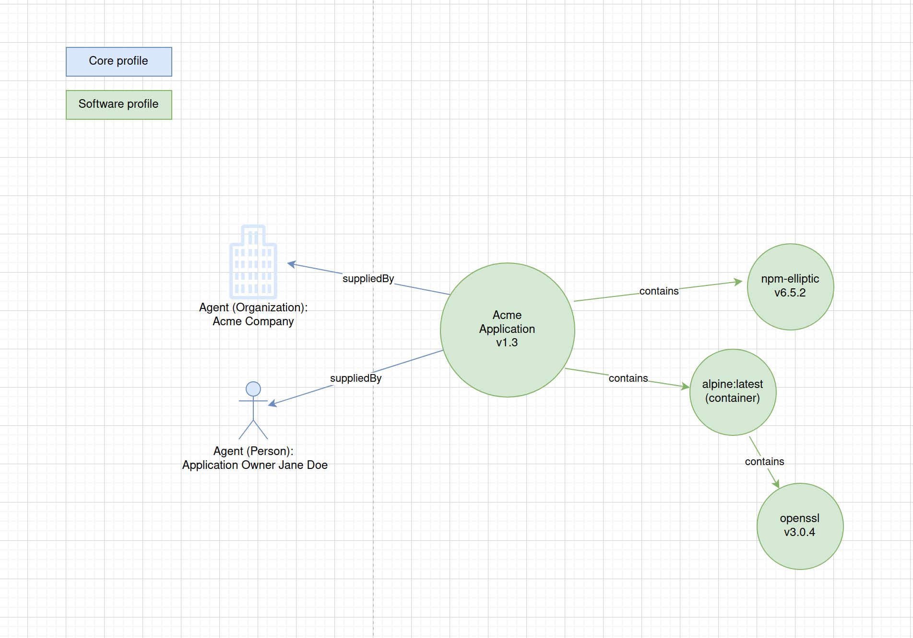

# Python Implementations of SPDX-3.0 generation

These examples are meant to illustrate how tools may create SPDX 3.0 documents and how they may interact with each other. The examples follows the toy scenario below:

## Documents

- `simple.py` is used to produce the `simple_acme.json` file. It requires Python3.10 to run. In your environment, run `simple.py | jq | tee <output_file_name>.json` to get the example content.
- `depcontainer.py` is used to produce the `container.json` file.
- Both `simple.py` and `depcontainer.py` assume the same `CreationInfo` for all the elements generated. Both implementations faithfully reproduce the `CreationInfo` for all serialized elements.
