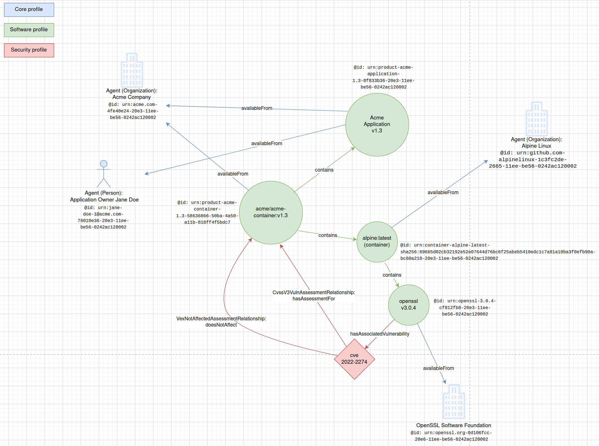

# Python implementations for SPDX 3.0 document generation and manipulation: multiple elements use case

This implementation showcases how multiple SPDX documents can be created at different times, thus having a set of elements with one creationInfo and set of profiles, and another set of elements having another creationInfo and a set of profiles.

We will follow an example similar to the previous implementation examples but with security elements:

- Acme Application is authored by Jane Doe who is affiliated with Acme Company.
- Acme Application is containerized by some internal process within Acme Company and is deployed to a container registry with the reference `acme/acme-container:v1.3`.
- Acme-container uses a base container `alpine:latest` and adds the Acme Application to it.
- `alpine:latest` contains `openssl` which is supplied by the OpenSSL Software Foundation.
- `openssl` version `v3.0.4` has an associated vulnerability CVE-2022-2274, but does not affect the Acme-container.

## Code

- `app_compact.py` generates a JSON payload describing the Acme Application and its suppliers. Dependencies are not listed in the payload. This implementation creates the compact version of the SPDX JSON serialization and embeds the `type` of the concrete class in the payload. This implementation also includes `created_using` which is `app_compact.py`.
- `container_compact.py` generates a JSON payload describing the container "alpine:latest" which resolves to "namespace/alpine@digest" depending on what client is used to download the container. It is not clear to the agent creating the document what the final url of the container is. The JSON payload will refer to an included component OpenSSL.
- In order to simulate document creation order, run `app_compact.py` and `container_compact.py` with some time between them so the timestamps are different.
- `app_in_container.py` generates a JSON payload describing the containerized acme application. It has references to the other two documents. The names of the documents are hard coded.

## Documents

- `acme_compact.json` is generated using `app_compact.py`
- `alpine_compact.json` is generated using `container_compact.py` soon after running `acme_compact.json`
- `acme_container.json` is generated using `app_in_container.py` with references to the above documents.

## Notes

- In order for `app_in_container.py` to generate ExternalMap for documents, it needs to first know where to fetch the documents from. A CLI implementation can provide options for including external document imports, but should be smart enough to resolve the location of the file, whether it exists on the local filesystem or in some remote location.
- The implementation already knows which document refers to which app and hence can ascertain the relationship, but in order to scale, there needs to be some other operation to figure out the relationships among the documents.
